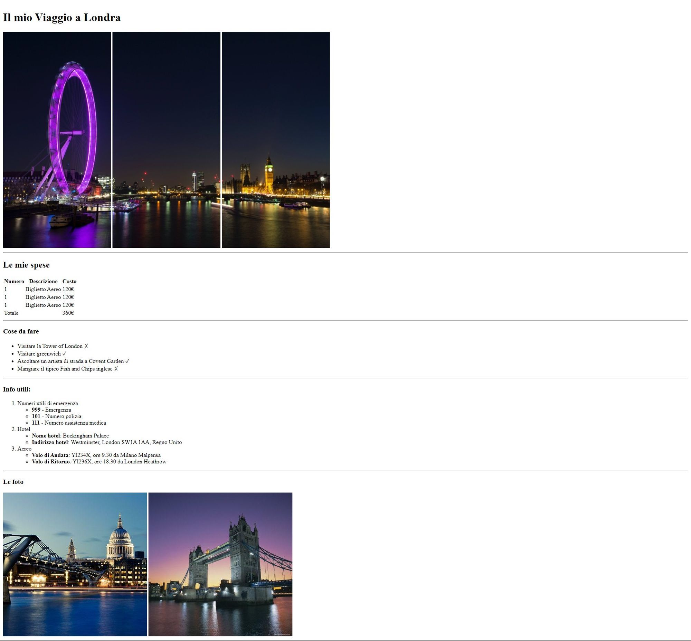

# Viaggio a Londra

Questo progetto ha lo scopo di riprodurre il layout di un sito web basandoci sui tag HTML che abbiamo appreso durante la sessione.

## Layout di Riferimento

## Struttura

├── README.md
├── index.html
├── img
│ ├── pexels-bill-emrich-230794-0.jpg
│ ├── pexels-bill-emrich-230794-1.jpg
│ ├── pexels-bill-emrich-230794-2.jpg
│ ├── Viaggio-Londra.jpg
├── css
│ └── style.css
